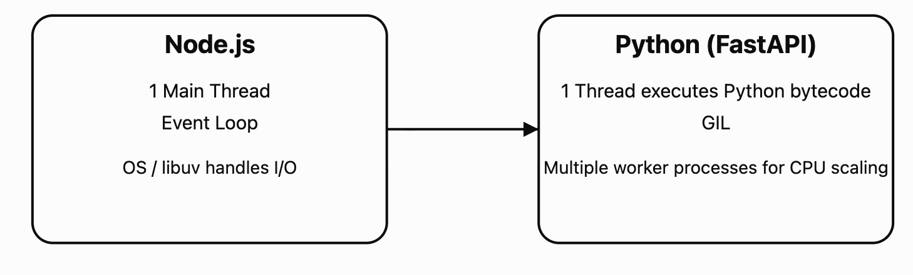

Since you're coming from Node.js, it's useful to learn Python by mapping the underlying concepts rather than just syntax. Many concepts are shared, but some behave very differently.

# JavaScript vs Python core concepts

|Concept|JavaScript|Python|
| --- | --- | --- |
|Execution model|Single-threaded event loop|Single-threaded with GIL (CPython)|
|Async|`async/await`|`async/await`|
|Mutable objects|Objects, Arrays|Lists, Dicts, Sets|
|Immutable objects|String, Number, Boolean|String, Int, Float, Tuple|
|Pass by|Value/reference behavior|Object references|
|Closures|Yes|Yes|
|First-class functions|Yes|Yes|
|Classes|Yes|Yes|
|Garbage Collection|Yes|Yes|
|Generators|Yes|Yes|
|Iterators|Yes|Yes|

Let's go through the important ones.

# 1. Single-threaded execution

## JavaScript

Node.js executes JavaScript on a single main thread.

JavaScript

```
console.log("A");
console.log("B");
```

Only one statement runs at a time.

Async work is delegated to:

* libuv

* OS threads

* Thread pool

Example:

JavaScript

```
setTimeout(() => console.log("Timer"), 1000);
console.log("Done");
```

Output:

```
Done
Timer
```

## Python

CPython also executes Python bytecode on one thread at a time because of the Global Interpreter Lock (GIL).

Python

Run

```
print("A")
print("B")
```

### Difference

Node's single-thread model is its runtime design.

Python's limitation comes from the GIL, which prevents multiple Python threads from executing Python bytecode simultaneously within one process.

# 2. Event Loop

Both support asynchronous programming.

## JavaScript

JavaScript

```
async function getUser() {
  return "John";
}
```

## Python

Python

Run

```
async def get_user():
    return "John"
```

Await works similarly.

Python

Run

```
result = await get_user()
```

FastAPI uses this heavily.

# 3. Mutable vs Immutable

This is one of the biggest Python concepts.

## Mutable

Can change after creation.

### JavaScript

JavaScript

```
const arr = [1,2];
arr.push(3);
```

### Python

Python

Run

```
arr = [1,2]
arr.append(3)
```

Both modify the same object.

Common mutable types:

|JavaScript|Python|
| --- | --- |
|Array|List|
|Object|Dict|
|Set|Set|
|Map|Dict (or `collections`)|

## Immutable

Cannot change.

### String

JS

JavaScript

```
let s = "hello";
s = s.toUpperCase();
```

Python

Python

Run

```
s = "hello"
s = s.upper()
```

Neither modifies the original string.

## Numbers

Both are immutable.

Python

Run

```
x = 5
x += 1
```

A new integer object is created.

# 4. Tuple (Python-only immutable list)

JavaScript has no direct equivalent.

Python

Run

```
point = (10,20)
```

Cannot do:

Python

Run

```
point[0] = 50
```

Useful for:

* coordinates

* database rows

* hashable keys

# 5. Object references

This often surprises Node developers.

## JavaScript

JavaScript

```
const a = {x:1};
const b = a;
b.x = 2;
```

Both become:

```
{x:2}
```

## Python

Exactly the same.

Python

Run

```
a = {"x":1}
b = a

b["x"] = 2
```

Output:

Python

Run

```
{'x':2}
```

Variables hold references.

# 6. Copy vs Reference

### Shallow copy

JS

JavaScript

```
const copy = {...obj};
```

Python

Python

Run

```
copy = obj.copy()
```

Nested objects are still shared.

### Deep copy

Python

Python

Run

```
import copy

deep = copy.deepcopy(obj)
```

JS equivalent is `structuredClone()`.

# 7. Truthy and Falsy

Very similar.

|Value|JS|Python|
| --- | --- | --- |
|`0`|False|False|
|`""`|False|False|
|`null` / `None`|False|False|
|Empty array/list|True|False|
|Empty object/dict|True|False|

Important difference:

JavaScript

JavaScript

```
if ([]) console.log("yes");
```

Prints.

Python

Python

Run

```
if []:
    print("yes")
```

Does not print.

# 8. Equality

## JavaScript

JavaScript

```
==

===
```

`===` avoids coercion.

## Python

Python

Run

```
==

is
```

They mean different things.

### Value comparison

Python

Run

```
a = [1]
b = [1]

a == b
# True
```

### Identity comparison

Python

Run

```
a is b
# False
```

`is` checks whether both variables reference the same object.

Think of:

|JavaScript|Python|
| --- | --- |
|`===`|`==` (mostly)|
|Same reference|`is`|

# 9. Functions are first-class

JS

JavaScript

```
const fn = () => "hello";
```

Python

Python

Run

```
def fn():
    return "hello"
```

Pass them around.

Python

Run

```
def execute(callback):
    callback()
```

Same concept.

# 10. Closures

Both support closures.

JavaScript

JavaScript

```
function counter(){
 let count=0;
 return ()=>++count;
}
```

Python

Python

Run

```
def counter():
    count = 0

    def inc():
        nonlocal count
        count += 1
        return count

    return inc
```

Python requires `nonlocal` to modify an outer variable.

# 11. Iteration

JS

JavaScript

```
for(const item of arr){}
```

Python

Python

Run

```
for item in arr:
    pass
```

Very similar.

# 12. Higher-order functions

|JavaScript|Python|
| --- | --- |
|`map()`|`map()`|
|`filter()`|`filter()`|
|`reduce()`|`functools.reduce()`|

Python usually prefers comprehensions.

Instead of:

Python

Run

```
list(map(lambda x: x*x, nums))
```

You'll often write:

Python

Run

```
[x*x for x in nums]
```

# 13. Generators

Both have lazy generators.

JS

JavaScript

```
function* numbers(){
 yield 1;
 yield 2;
}
```

Python

Python

Run

```
def numbers():
    yield 1
    yield 2
```

Useful for streaming data.

# 14. Exceptions

Very similar.

JS

JavaScript

```
try{

}catch(err){

}
```

Python

Python

Run

```
try:
    pass
except Exception as err:
    pass
finally:
    pass
```

# 15. Memory management

Both have garbage collection.

You rarely free memory manually.

Python additionally uses:

* reference counting

* cyclic garbage collector

# 16. Concurrency model

This is the biggest practical difference for backend work.

|Task|Node.js|Python|
| --- | --- | --- |
|HTTP server|Event loop|Event loop (FastAPI/uvicorn)|
|File I/O|Async|Async|
|Database|Async|Async|
|CPU-heavy work|Worker Threads|Multiprocessing|
|Multiple CPU cores|Cluster|`multiprocessing` or multiple workers|

### CPU example

Node

JavaScript

```
worker_threads
```

Python

Python

Run

```
from multiprocessing import Process
```

For FastAPI in production, you'll commonly run multiple uvicorn workers (processes), which bypasses the GIL.

## Mental model for a Node.js developer

